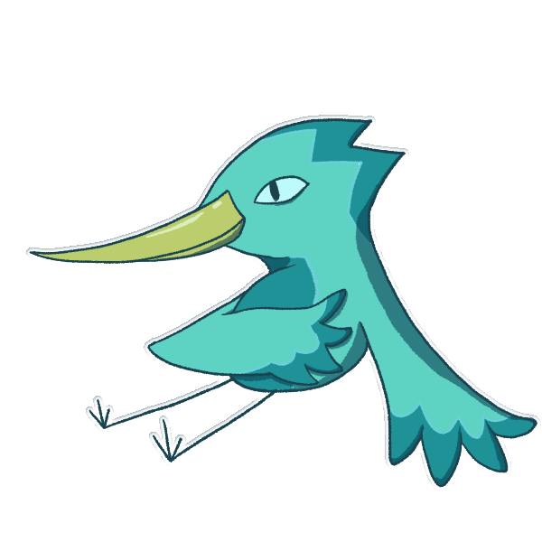

# KaosTeam

Trabajo para Proyectos II de Kaos Team, un grupo de estudiantes de segundo del Grado de Desarrollo de Videojuegos en la Universidad Complutense de Madrid.

# Flonk! - Game Design Document

## Introducción

_Flonk!_ es un juego de aventuras al estilo más clásico en el que Flonk, la rana deberá salir del charco para salvar a su hermana del malvado chef francés que planea hacer un guiso con ella.

## Mecánicas del jugador

El movimiento del juego está basado en saltos de casilla en casilla en un tablero donde la acción se desarrollará. También tendrá un set de habilidades iniciales que luego serán mejoradas con mejoras que aumentarán la fuerza y utilidad de estas y se podrá ampliar el repertorio de habilidades disponibles con otras mejoras obtenidas durante la partida.

- **Movimientos básicos**

  - **Movimiento basado en saltos** pequeños de una casilla y saltos largos cuyo alcance depende de las mejoras previas y el input del jugador.

  - **Ataque básico** con la lengua de la rana. Este afectaría a las casillas en la dirección que el jugador apunte/mire y su alcance dependerá de las mejoras.
  - **Escudo** con el saco hinchable de la rana localizado en la parte inferior de su boca. La rana lo usará para defenderse y rechazar ataques que provengan de determinada dirección.
  - **Mejoras:** durante la aventura,el jugador podrá devorar bichos especiales que le otorgarán mejoras permanentes a las habilidades básicas:
    - **Saltamontes** : permiten al jugador mantener pulsado el botón de salto para llegar más lejos.
    - **Moscas de la vida** : aumentan la vida máxima del jugador.
    - **Por determinar** : aumentan el ataque de los ataques básicos.
    - **Por determinar** : aumentan el alcance de los ataques básicos.

- **Habilidades extras desbloqueables**
  - **Gancho** de pesca atado a la lengua que se podrá usar tanto en combate para atacar a los enemigos como para desplazarse más eficientemente y poder alcanzar lugares nuevos. Se desbloquea en la mazmorra principal del bosque (árbol del Ovi (nombre sin confirmar)) y será necesario conseguirlo para progresar.

  - **Hormigas explosivas rojas y saco de hormigas** , estas hormigas se pueden usar como bombas contra enemigos y para acceder a sitios previamente inaccesibles (rompiendo paredes o resolviendo puzzles). En un principio las hormigas bombas serían enemigos que usarías pero más adelante (en el hormiguero) el jugador conseguiría un saco donde guardarlas para poder transportarlas y usarlas luego sin ser atado a habitaciones o zonas específicas.

- **Power Ups**

Al romper objetos o matar enemigos, podrán aparecer aleatoriamente power ups que otorgarán al jugador un poder especial de forma temporal.

  - **Luciérnagas** que hacen brillar al jugador, iluminando la oscuridad a su alrededor.
  - Por desarrollar…

## Enemigos

A lo largo del juego, el jugador deberá hacer frente a distintos tipos de enemigos distribuidos por las diferentes zonas:

### Estanque

En desarrollo: probablemente contendrá algunos enemigos con patrones de ataque y movimiento sencillos ya que se trata de la primera zona y actúa como tutorial.

### Bosque

- **Serpientes:** En desarrollo…

- **Las termitas** suelen ir en grupos de 4, pero pueden aparecer en más cantidades. Son muy rápidos pero poco resistentes. Se matan de un solo golpe.

### Hormiguero

En esta zona, los insectos tratarán de defender su hogar atacándote. Hay 2 tipos de enemigos característicos de estas zonas:

- **Las hormigas,** estos insectos sociales suelen ir solos a la hora de atacar.

Son algo lentos, pero son bastante resistentes. Suelen morir de 3 golpes.

- **Las termitas** suelen ir en grupos de 4, pero pueden aparecer en más cantidades. Son muy rápidos pero poco resistentes. Se matan de un solo golpe.

### Zona de la cocina del chef francés

En desarrollo…

## Cámara

El juego es 2D top down, por tanto la cámara al moverse lo hará de forma scroll lateral. Cuando el tamaño de la sala sea igual o menor al de la pantalla la cámara será fija, cuando el tamaño de la sala sea mayor, si el jugador está en el área central de la cámara, esta no se moverá, pero si se desplaza más a la derecha, izquierda, por encima o por debajo de ese área, la cámara "seguirá" al jugador.

Mecánicas del escenario

Objetos que se activan con el gancho (de momento solo palanca): objetos que al ser golpeados con el gancho hacen algo.

Piedras movibles: piedras las cuales se pueden empujar.

**Objetos rompibles (vasijas de momento):** objetos que puedes romper y pueden estar vacíos o tener algo en su interior (dinero, vida).

**Huecos para saltar:** en el escenario habrá huecos para los cuales se necesita mejorar el salto para poder pasar.

**Objetos explotables:** objetos en el escenario los cuales solo se pueden destruir con bombas (hormigas rojas).

## Diseño de niveles

Nuestro juego está dividido en diferentes zonas, donde habrá enemigos y objetos, diferentes.

### Descripción de los niveles

### Estanqu

Diseño inicial sin finalizar

El estanque es la zona inicial y la que conecta a las otras tres zonas, conectando con el bosque por la derecha estando bloqueada por piedras movibles, el hormiguero por arriba donde se necesita el gancho para entrar y la cocina por la derecha donde se necesita bombas para continuar.

La zona actúa de tutorial en el que el jugador encontrará los primeros enemigos.

También hay objetos rompibles y explotables (para los que se necesitarán hormigas rojas) y los primeros huecos (para los que necesitas una mejora de salto). De esta forma el jugador es incentivado a volver a los lugares por donde ya ha pasado.

En la parte superior y al casi al final del recorrido inicial del jugador, se encuentra la tienda, en la que podrá entrar pero no tendrá suficiente dinero para comprar. Al estar en la zona central el jugador podrá regresar y comprar objetos en cada paso de su aventura. (Más adelante se explica con detalle el funcionamiento de la tienda).

### Bosque

**El bosque** es una zona amplia dividida en varías subzonas interconectadas y hasta cierto punto independientes con diferentes desafíos.

Esquema conceptual de la zona con sus subdivisiones. (cambiar por mejora)

**Camino de piedras** es la subzona inferior derecha que actúa como entrada e introducción desde el estanque. Es una subzona de transición con aspecto de cañón entre rocas de origen natural. Tiene dos salidas una hacia el árbol (superior) y otra

hacia los escombros (izquierda) y tendrá enemigos repartidos a lo largo del camino.

**Escombros/Ruinas** es la subzona inferior central accesible por arriba desde el cruce y la izquierda por el cañón. El principal atractivo es un montón de escombros en el centro donde se podrá entrar y en cuyo interior habrá un combate complicado contra varios enemigos donde se recompensará al final con una mejora.

**Árbol del Ovi** es la subzona en la esquina superior derecha accesible desde el cañón por el lado inferior y el cruce por el lado izquierdo. Está zona contiene la mazmorra principal de la zona. Un árbol centenario que con espacio en su interior que sigue una estructura como de un árbol. Una zona ascendente compacta a modo de tronco y una copa con una estructura más "radial" donde se necesitara usar el gancho. El combate contra el jefe empezará después de caerse de una rama en un evento scripteado.

**Cruze** es la subzona central superior. Es una zona de transición donde estará localizado el pájaro mercante y conectará con las subzonas el árbol de Ovi (derecha), escombros (inferior) y riachuelo seco tanto como la zona superior como la inferior (izquierda). No tiene nada interesante más allá del mercante y quizás algún cartel o NPC.

**Riachuelo seco** es una subzona que ocupa todo el lado izquierdo pero realmente son dos subzonas una encima de otra. La zona superior será atravesable con el gancho para llegar al hormiguero y la zona inferior será una zona 'secreta' que contendrá alguna mejora.

### Hormiguero

El hormiguero está dividido en 5 salas.

Las salas 1, 2, 3 y 5 ocupan el tamaño de la pantalla, por lo tanto la cámara es fija. En cambio, la sala 4 es más grande de lo que abarca la cámara, por lo que la cámara seguirá al jugador.

- **Sala 1:** en esta primera sala, se le va a presentar al jugador las hormigas rojas para que descubra que si se las traga y luego las suelta, sirven de bomba. Desde esta sala puede dirigirse a la sala 2, que está bloqueada pero si utiliza la bomba conseguirá abrirla, o a la sala 4, que hasta que no consiga la llave que abre esa puerta no podrá ir hacia esta sala.
- **Sala 2:** en esta sala el jugador se va a encontrar un acertijo para abrir la puerta a la sala 3. El jugador se va a encontrar con una cinta transportadora, un interruptor y un _spawn_ de hormigas bombas. Va a necesitar una bomba para colocarla al inicio de la cinta, que la bomba se transporte hasta el interruptor y que gracias a la bomba este se active y así abrir la puerta a la sala 3. En esta sala también se presenta a uno de los enemigos de esta zona, las hormigas negras, que irán a atacar al jugador. Desde esta sala se puede volver a la sala 1.
- **Sala 3:** en esta sala el jugador se va a encontrar con jarrones que al romperlos se descubrirá si tenían algo dentro. Uno de estos contendrá la llave que permite abrir la puerta de la sala 4. En esta sala también hay una zona donde hay colocados un par de huevos de hormigas, pero hay huecos donde faltan. En esta sala se presenta a los otros enemigos de esta zona, habrá dos _spawns_ de oleadas de termitas(el tiempo de _spawn_ es alto para que no sean muy molestas). Desde esta sala se puede volver a la sala 2.
- **Sala 4:** cuando el jugador haya encontrado la llave que permite abrir esta sala, se va a encontrar otro acertijo. Para abrir la puerta que le lleva a la sala 5, tiene que activar cuatro interruptores. Entre el suelo por donde va la rana y los interruptores no hay nada, por lo que si se intenta ir por ahí se caerá al vacío. Por lo tanto, estos interruptores son inalcanzables por la lengua gancho y tampoco se llega saltando. Para activar los interruptores, el jugador tendrá que poner a prueba su puntería y lanzar bombas a los interruptores para activarlos. Para tener suficientes intentos, hay un _spawn_ de hormigas rojas en el centro de la sala, pero no va a ser fácil porque en cada lateral también habrá un _spawn_ de hormigas negras que molestarán al jugador.

Cuando consiga activar los cuatro interruptores, se abrirá la puerta a la sala 5. Desde esta sala se puede volver a la sala 1.

- **Sala 5:** al entrar a esta última sala, se bloquea la puerta para volver a la sala 4 y la puerta para salir del hormiguero está cerrada. En las esquinas de esta sala se encuentran los cuatro huevos de hormiga que faltaban en los huecos de la sala 3, pero están encerrados. Para poder desbloquear los huevos de hormigas, el jugador se va a enfrentar a una oleada de enemigos(hormigas negras, termitas y también van a haber hormigas rojas) donde hay que matar a todos. Cuando esto se consiga, el jugador va a desbloquear el "saco de bombas" para que pueda almacenar más de una bomba. A la vez, también se van a desbloquear los huevos de hormiga. Estos huevos son necesarios para abrir la puerta para salir de la zona. Hay que llevarlos a la sala 3 y colocarlos en los huecos donde faltan

### Zona de la cocina del chef francés

Tienda

Durante la aventura el jugador encontrará lombrices de uróboros que podrá intercambiar con un curioso pájaro por mejoras en la tienda.

El precio de las mejoras será relativamente alto, por lo que el jugador no podrá adquirirlas de buenas a primeras.

Las lombrices se pueden encontrar por todo el juego al romper objetos o al matar enemigos. Hay varios tipos de lombrices de uróboros con un valor ascendente según su rareza.

## HUD

### HUD In-Game

Esta interfaz consta de dos elementos muy sencillos.

Por un lado tenemos en la esquina superior izquierda una barra con iconos de mosca que representan las vidas de nuestro personaje. La cantidad de moscas que posee la barra, coincide con el número de vidas totales que el jugador puede adquirir. Si una mosca está teñida de un tono claro, el jugador posee esa vida, de lo contrario, si está teñida de un tono más oscuro entonces no la posee.

Por último, en la esquina superior derecha, se muestra un icono de una lombriz (que es como se representa el dinero en el juego) junto a un contador (que nos indica la cantidad de dinero en el juego). A medida que el jugador obtenga lombrices, dependiendo de su color, el contador aumenta una cantidad u otra.

Estética y Visual

El juego tendría un aspecto de dibujo en un entorno tridimensional al estilo de Paper Mario y "garabato vivo" al de Ed, Edd & Eddy. Y los animales tendrán tamaño y aspecto "realistas" hasta cierto punto. No serán 100% similares a sus contrapartes reales y se tomarán libertades creativas pero tendrá cierto grado de realismo. Como que la mayoría de los enemigos sean depredadores naturales de las ranas y la mejoras sean presas naturales o al menos factibles.
