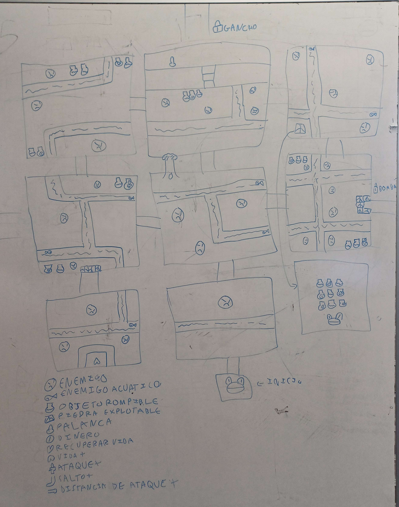
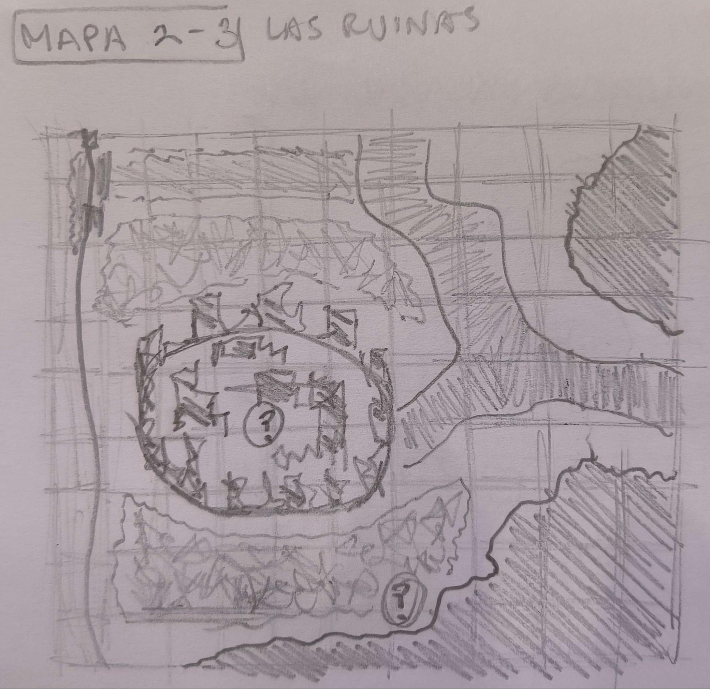
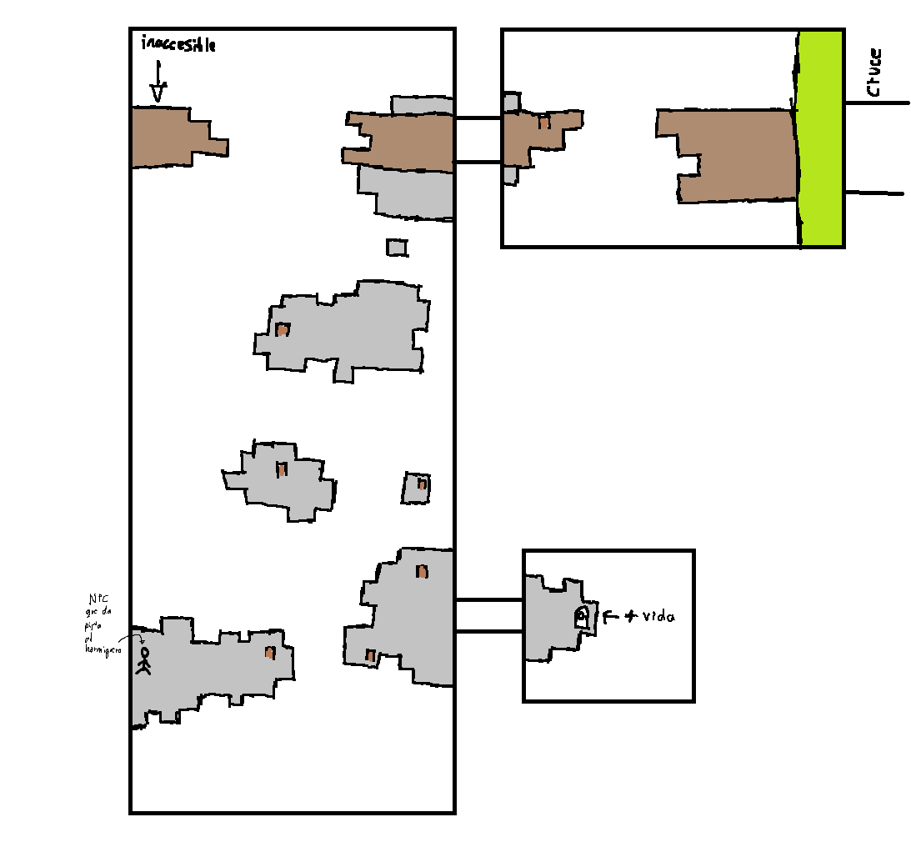
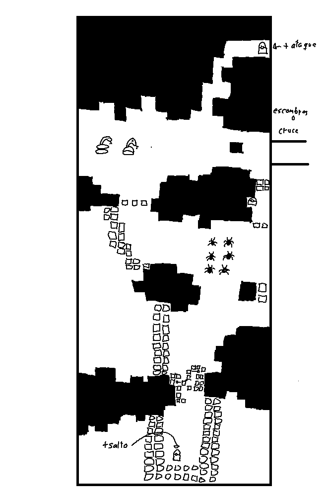

# KaosTeam

Trabajo para Proyectos II de Kaos Team, un grupo de estudiantes de segundo del Grado de Desarrollo de Videojuegos en la Universidad Complutense de Madrid.

# Flonk! - Game Design Document

## Introducción

_Flonk!_ es un juego de aventuras de estilo clásico en el que Flonk, la rana deberá salir del charco para salvar a su hermana del malvado chef francés que planea hacer un guiso con ella.

Mecánicas del jugador

## Mecánicas del jugador

El movimiento del juego está basado en saltos de casilla en casilla en un tablero donde se desarrollará la acción. También tendrá un set de habilidades iniciales que luego serán mejoradas con mejoras que aumentarán la fuerza y utilidad de estas.

- **Movimientos básicos**

  - **Movimiento basico de salto** de casilla en casilla. El movimiento es arriba, abajo, izquierda o derecha pulsando la tecla correspondiente.
  - **Salto largo** para avanzar varias casillas. De base se saltarán dos casillas, aumentando con la mejora. Para utilizar el salto largo se mantiene pulsado el botón de movimiento correspondiente a la dirección.
  - **Ataque básico** con la lengua de la rana. Este afectaría a las casillas en la dirección que el jugador apunte/mire. El alcance inicial es de dos casillas, aumentará con la mejora. El daño inicial que hace es de 1 golpe, aumentará con la mejora.
  - **Escudo** con el saco hinchable de la rana localizado en la parte inferior de su boca. Lo usará para defenderse y rechazar ataques que provengan de determinada dirección.
- **Mejoras**

  - **Saltamontes** que amplian el alcance del salto largo en una casilla.
  - **Moscas de la vida** que aumentan la vida máxima del jugador en media mosca.
  - **Avispas**: aumentan el daño de los ataques de la lengua en uno de daño.
  - **Ciempiés**: aumentan el alcance del ataque de la lengua en una casilla.

- **Habilidades extras desbloqueables**
  - **Gancho** de pesca atado a la lengua. Se podrá usar tanto en combate para atacar a los enemigos como para desplazarse más eficientemente y poder alcanzar lugares nuevos. Se desbloquea en la mazmorra principal del bosque (árbol del Ovi (nombre sin confirmar)) y será necesario conseguirlo para poder avanzar en las zonas posteriores. Su alcance es de cinco casillas.
  - **Hormigas explosivas** rojas que se pueden usar como bombas contra enemigos, para acceder a sitios previamente inaccesibles rompiendo las paredes o necesarias para resolver puzzles.
   - **Saco de hormigas** desbloqueable en el hormiguero. Permitirá a la rana poder almacenar más de una hormiga roja y poder transportarlo y usarlo cuando quiera. 
  

- **Controles**

  - **Flechas** : con las que se mueve la rana según la dirección (derecha, izquierda, arriba, abajo).
  - **Z** : acción 1, escudo, seleccionar botón, en la tienda mover hacia la izquierda.
  - **X** : acción 2, atacar con lengua, en la tienda comprar.
  - **C** : acción 3, atacar con lengua gancho, en la tienda mover hacia la derecha.
  - **V** : acción 4, lanzar items como bombas, orbes, cabeza de cucaracha.
  - **SHIFT + ACTION** : se realiza la acción correspondiente pero con la mejora (salto más largo, distancia del ataque de la lengua más larga).
  - **ESC** : ir al menú de pausa.

Enemigos

## Enemigos

A lo largo del juego, el jugador deberá hacer frente a distintos tipos de enemigos distribuidos por las diferentes zonas:

### Estanque

Vida: 1 golpe
Daño recibido: Media Mosca
- **Ranas locas** 
Son ranas las cuales, debido a la contaminación del Estanque traído por el chef, han perdido su cordura. Estas avanzaran lentamente de una casilla a otra intentando seguir a Flonk (como zombis) atacando con sus lenguas (las cuales tiene un rango melee a diferencia de Flonk debido a la contaminación). El movimiento de estas ranas está limitado por un tiempo de espera antes de que se muevan a su siguiente casilla.

Vida: 1 golpe
Daño recibido: Media Mosca
- **Peces** Estos nadan en los ríos del estanque siguiendo un camino fijo. A lo largo de su recorrido en un sitio específico saltarán del agua y caerán. Cuando terminan su recorrido, estos lo repetirán pero en el sentido contrario (irán de un lado para el otro en el río). Si a la hora de saltar sobre el río, Flonk se cruza en su salto con un pez, Flonk recibe daño y es enviado a la casilla donde estaba antes de saltar. 

### Bosque

Vida: 3 Golpes
Daño recibido: 1 mosca
- **Las serpientes** Actuan como torretas estaticas los cuales giran sobre su propio eje vigilando por si ven la rana. Si la serpiente detecta la rana, estos rápidamente extenderán sus cuellos para mordernos antes de volver a sus puestos. Si ha pasado suficiente tiempo sin que hayan mordido a Flonk, estos saltaran diagonalmente una casilla siendo esta casilla la más cercana posible a Flonk.

Vida: Depende del tamaño del cúmulo
Daño recibido: Media Mosca
- **Cúmulo de termitas** Estas siguen al jugador, son rápidas pero poco resistentes. Van en grupos que actúan como una sola entidad, al ser golpeanas se dividen por la mitad y se vuelven más rápidos. Estas solo se mueren cuando su tamaño llega al mínimo y cada uno de sus miembros son eliminados. 

### Hormiguero

En esta zona, los insectos tratarán de defender su hogar atacándote. Hay 2 tipos de enemigos característicos de estas zonas:

Vida: 3 Golpes
Daño recibido: 2 moscas 
- **Las hormigas** suelen ir en grupo a la hora de atacar. Son de los enemigos más fuertes del juego. El comportamiento de estas serán parecidas a la de un toro. Cuando estas detectan a Flonk, las hormigas empiezan a cargar una embestida (lo cual tarda 1 segundo) antes de correr en linea recta ferozmente hacia Flonk. Si Flonk esquiva el ataque y estas chocan contra la pared se quedarán inmóbiles por unos cuantos segundos antes de recuperarse.

Vida: 1 golpe 
Daño recibido: Media mosca
- **Las termitas** suelen ir en grupos de 4, pero pueden aparecer en más cantidades. Son muy rápidas pero poco resistentes. Su comportamieno es la de rápidamente seguir al jugador pero al mismo tiempo infligiendo poco daño.

Vida: Depende del tamaño del cúmulo
Daño recibido: Media Mosca
- **Cúmulo de termitas** Van en grupos que actúan como una sola entidad, al ser golpeanas se dividen por la mitad y se vuelven más rápidos.  Estas solo se mueren cuando su tamaño llega al mínimo y cada uno de sus miembros son eliminados. Estas, como las termitas, siguen al jugador y el cúmulo cuando sea lo suficientemente pequeño, al darles saldrán termitas normales.

### Zona de la cocina del chef francés

Vida: 2 golpes
Daño recibido: Media Mosca
- **Cucarachas** No atacan, simplemente Flonk tiene que derrotarlas y estas al morir sueltan su cabeza que Flonk puede recoger y lanzar más tarde para atacar.

Cámara

## Cámara

El juego es 2D top down, por tanto la cámara al moverse lo hará de forma scroll lateral. Cuando el tamaño de la sala sea igual o menor al de la pantalla de juego, la cámara se quedará fija. Cuando el tamaño de la sala sea mayor, si el jugador está en el área central de la cámara, esta no se moverá, pero si se desplaza más a la derecha, izquierda, por encima o por debajo de ese área, la cámara "seguirá" al jugador.

Cuando el jugador supere el límite del tamaño de la cámara en cualquiera de las direcciones, la cámara seguirá al jugador con este en el centro hasta los límites de la sala.

Mecánicas del escenario

## Mecánicas del escenario

**Objetos que se activan con el gancho**: objetos que al ser golpeados con el gancho hacen algo (como palancas o interruptores)

**Piedras movibles**: piedras las cuales se pueden empujar.

**Objetos rompibles (vasijas de momento):** objetos que puedes romper y pueden estar vacíos o tener algo en su interior (dinero, vida, objetos como llaves).

**Huecos para saltar:** en el escenario habrá huecos para los cuales se necesita mejorar el salto para poder pasar.

**Objetos explotables:** objetos en el escenario los cuales solo se pueden destruir con bombas (hormigas rojas) o su utilidad se activa gracias a la bomba. Por ejemplo, **los interruptores** se activan con bombas y permiten abrir puertas.

Diseño de los niveles

## Diseño de niveles

Nuestro juego está dividido en diferentes zonas, donde habrá enemigos y objetos, diferentes.

### Descripción de los niveles

### Estanque

El estanque es la zona inicial y la que conecta a las otras tres zonas, conectando con el bosque por la izquierda, el hormiguero por arriba donde se necesita el gancho para entrar y la cocina por la derecha donde se necesita bombas para continuar.

La zona actúa de tutorial en el que el jugador encontrará los primeros enemigos.

También hay objetos rompibles y explotables (para los que se necesitarán hormigas rojas) y los primeros huecos (para los que necesitas una mejora de salto). De esta forma el jugador es incentivado a volver a los lugares por donde ya ha pasado.

En el centro, se encuentra la tienda, en la que podrá entrar pero no tendrá suficiente dinero para comprar. Al estar en la zona central el jugador podrá regresar y comprar objetos en cada paso de su aventura. (Más adelante se explica con detalle el funcionamiento de la tienda).

### Bosque

**El bosque** es una zona amplia dividida en varías subzonas interconectadas y hasta cierto punto independientes con diferentes desafíos.

Esquema conceptual de la zona con sus subdivisiones. (cambiar por mejora)

**Camino de piedras** es la subzona inferior derecha que actúa como entrada e introducción desde el estanque. Es una subzona de transición con aspecto de cañón entre rocas de origen natural. Tiene dos salidas una hacia el árbol (superior) y otra

hacia los escombros (izquierda) y tendrá enemigos repartidos a lo largo del camino.

**Escombros/Ruinas** es la subzona inferior central accesible por arriba desde el cruce y la izquierda por el cañón. El principal atractivo es un montón de escombros en el centro donde se podrá entrar y en cuyo interior habrá un combate complicado contra varios enemigos donde se recompensará al final con una mejora.

**Árbol del Ovi** es la subzona en la esquina superior derecha accesible desde el cañón por el lado inferior y el cruce por el lado izquierdo. Está zona contiene la mazmorra principal de la zona. Un árbol centenario que con espacio en su interior que sigue una estructura como de un árbol. Una zona ascendente compacta a modo de tronco y una copa con una estructura más "radial" donde se necesitara usar el gancho. El combate contra el jefe empezará después de caerse de una rama en un evento scripteado.

**Cruze** es la subzona central superior. Es una zona de transición donde estará localizado el pájaro mercante y conectará con las subzonas el árbol de Ovi (derecha), escombros (inferior) y riachuelo seco tanto como la zona superior como la inferior (izquierda). No tiene nada interesante más allá del cartel o NPC.

**Riachuelo seco** es una subzona que ocupa todo el lado izquierdo pero realmente son dos subzonas una encima de otra. La zona superior será atravesable con el gancho para llegar al hormiguero y la zona inferior será una zona 'secreta' que contendrá alguna mejora.

### Hormiguero

El hormiguero está dividido en 5 salas.

Las salas 1, 2, 3 y 5 ocupan el tamaño de la pantalla, por lo tanto la cámara es fija. En cambio, la sala 4 es más grande de lo que abarca la cámara, por lo que la cámara seguirá al jugador.

- **Sala 1:** en esta primera sala, se le va a presentar al jugador las hormigas rojas para que descubra que si se las traga y luego las suelta, sirven de bomba. Desde esta sala puede dirigirse a la sala 2, que está bloqueada, pero si utiliza la bomba conseguirá abrirla, o a la sala 4, que hasta que no consiga la llave que abre esa puerta no podrá ir hacia esta sala. En este punto del juego, el jugador no puede guardar bombas, por lo que en la parte inferior izquierda hay un _spawn_ de hormigas rojas para que el jugador no se quede atrapado. 
- **Sala 2:** en esta sala el jugador se va a encontrar un acertijo para abrir la puerta que le dirige a la sala 3. El jugador se va a encontrar con una cinta transportadora, un interruptor y un _spawn_ de hormigas bombas. Va a necesitar una bomba para colocarla al inicio de la cinta, que la bomba se transporte hasta el interruptor y que gracias a la bomba, este se active y así abrir la puerta a la sala 3. En esta sala también se presenta a uno de los enemigos de esta zona, las hormigas negras, que irán a atacar al jugador. Desde esta sala se puede volver a la sala 1.
- **Sala 3:** en esta sala el jugador se va a encontrar con vasijas que ,al romperlas, se descubrirá si tenían algo dentro. Uno de estos contendrá la llave que permite abrir la puerta de la sala 4. En esta sala también hay una zona donde hay colocados un par de huevos de hormigas, pero hay huecos que faltan por rellenar. En esta sala se presenta a los otros enemigos de esta zona, habrá dos _spawns_ de oleadas de termitas en las partes laterales de la sala(el tiempo de _spawn_ es alto para que no sean muy molestas). Desde esta sala se puede volver a la sala 2.
- **Sala 4:** cuando el jugador haya encontrado la llave que permite abrir esta sala, se va a encontrar otro acertijo. Para abrir la puerta que le lleva a la sala 5, tiene que activar cuatro interruptores. Entre el suelo por donde camina la rana y los interruptores no hay nada, por lo que si se intenta ir por ahí, el jugador caerá al vacío (el jugador perdería corazones). Por lo tanto, estos interruptores son inalcanzables por la lengua gancho y tampoco se llega saltando. Para activar los interruptores, el jugador tendrá que poner a prueba su puntería y lanzar bombas a los interruptores para activarlos. Para tener suficientes intentos hay un _spawn_ de hormigas rojas en el centro de la sala, pero no va a ser fácil porque en cada lateral también habrá un _spawn_ de hormigas negras que molestarán al jugador. Cuando consiga activar los cuatro interruptores, se abrirá la puerta a la sala 5. Desde esta sala se puede volver a la sala 1.
- **Sala 5:** al entrar a esta última sala, se bloquea la puerta para volver a la sala 4 y la puerta para salir del hormiguero está cerrada. En las esquinas de esta sala se encuentran los cuatro huevos de hormiga que faltaban en los huecos de la sala 3, pero están encerrados. Para poder desbloquear los huevos de hormiga, el jugador deberá enfrentar a una oleada de enemigos(hormigas negras, termitas y también van a haber hormigas rojas) y deberá derrotar a todos. Cuando esto se consiga, el jugador va a desbloquear el "saco de bombas" para que pueda almacenar más de una bomba. A la vez, también se van a desbloquear los huevos de hormiga. Estos huevos son necesarios para abrir la puerta para salir de la zona. Hay que llevarlos a la sala 3 y  colocarlos en los huecos donde faltan, utilizando ya la habilidad del saco de bombas. Al colocarlos se desbloqueará la puerta para salir definitivamente de esta zona.
### Zona de la cocina del chef francés

## Tienda

Durante la aventura, el jugador encontrará lombrices de uróboros que podrá intercambiar con un curioso pájaro por mejoras en la tienda. Estas lombrices se podrán encontrar al romper objetos o matar enemigos.
Hay varios tipos de lombrices de uróboros con diferente valor siendo este ascendente dependiendo de su rareza.

### Valores de uróboros
- Uróboro rosa: 1
- Uróboro morado: 5
- Uróboro dorado: 20
### Mejoras
- Avispa (15 uróboros): Flonk tendrá la capacidad de hacer 3 golpes de daño al atacar.
- Saltamonte (10 uróboros): en vez de saltar de casilla en casilla, Flonk tendrá la capacidad de saltar de tres en tres casillas.
- Mosca de la vida (15 uróboros): permite aumentar la vida máxima de Flonk.
- Ciempiés (20 uróboros): con esto va a aumentar el alcance de ataque de Flonk a seis casillas.

HUD

## HUD

### HUD In-Game

Esta interfaz consta de dos elementos muy sencillos.

Por un lado tenemos en la esquina superior izquierda una barra con iconos de mosca que representan las vidas de nuestro personaje. La cantidad de moscas que posee la barra, coincide con el número de vidas totales que el jugador puede adquirir. Si una mosca está teñida de un tono claro, el jugador posee esa vida, de lo contrario, si está teñida de un tono más oscuro entonces no la posee.

Además, en la esquina superior derecha, se muestra un icono de una lombriz (que es como se representa el dinero en el juego) junto a un contador (que nos indica la cantidad de dinero en el juego). A medida que el jugador obtenga lombrices, dependiendo de su color, el contador aumenta una cantidad u otra.

Estética y Visual

## Estética y Visual

El juego tendría un aspecto de dibujo en un entorno tridimensional al estilo de Paper Mario y "garabato vivo" al de Ed, Edd & Eddy. Y los animales tendrán tamaño y aspecto "realistas" hasta cierto punto. No serán 100% similares a sus contrapartes reales y se tomarán libertades creativas pero tendrá cierto grado de realismo. Como que la mayoría de los enemigos sean depredadores naturales de las ranas y la mejoras sean presas naturales o al menos factibles.

Menus de juego

## Menús de juego y flujo de juego

**Menú principal:**
 El juego comienza con un menú principal donde se encuentra un botón para empezar a jugar y un botón para salir del juego.

**Durante el juego:**
 En la pantalla se ve la interfaz descrita antes junto a un botón que permite ir al menú de pausa.

**Menú de pausa:** 
En el menú de pausa el jugador puede volver a la partida o salir ir al menú principal.

Flujo de juego

**Flujo de juego:** Cuando el jugador muere le aparecerá un menú que le informará de su muerte y le dará a elegir entre cerral el juego y continuar. En caso de que elija lo segundo la sala en la murió se reiniciará.

Historia

## Historia 

Flonk se despierta un día cualquiera y se entera que un chef francés ha secuestrado a su hermana con el objetivo de utilizarla
para hacer un guiso. Descontento con esto, Flok deberá salir de su estanque de confianza para salvar a su hermana del chef.
Se deberá enfrentar a los distintos animales que también viven por la zona para poder seguir avanzando a lo largo del estanque, cruzar el bosque,
atravesar el hormiguero hasta llegar a la cocina del chef.
Durante el camino, no solo habrá animales que atacaran a Flonk, habrá otros que le servirán de ayuda para superar el camino hasta la cocina.
Con las ayudas que obtenga por el camino, finalmente se deberá enfrentar al malvado chef francés para tratar de recuperar a su hermana.

Resources

## Resources
**Mapas de tiled:**
Objetos que tenemos en tiled segun la clase.
| Class | Names | Otras propiedades |
| :--- | :--- | :--- |
| Player | N - S - E - O = Segun la entrada por la que accedas a la sala. | *** |
| Enemigo | RanaLoca - Hormiga - ... = Tipo de enemigo.  | *** |
| ObjInter | Jarron - Piedra - ... = Tipo de objeto interactuable.  | *** |

***Las propiedades especificas al objeto, y no a su clase o nombre, se pasarán al createEntity.

Referencias

## Referencias

Hemos obtenido referencias de _The Legend of Zelda: A Link to the Past_ en cuanto a las mecánica, dinámica y escenarios. 
En cuanto a la estética, nos hemos inspirado en el estilo de _Paper Mario_ en cuanto al entorno tridimensional y
de _Ed, Edd & Eddy_ la idea del "garabato vivo".

